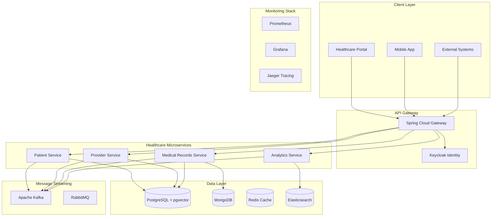
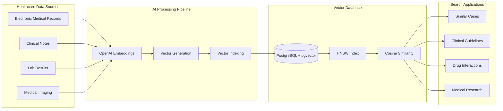

# Healthcare Semantic Database Platform

> 🏥 **Enterprise-grade healthcare platform demonstrating advanced microservices architecture, vector database integration, and big data processing capabilities. Built to showcase expertise in Java Spring Boot, AWS cloud services, and healthcare domain knowledge for Oracle Health opportunities.**

[](https://openjdk.java.net/)
[](https://spring.io/projects/spring-boot)
[](https://www.postgresql.org/)
[](https://github.com/pgvector/pgvector)
[](https://aws.amazon.com/)
[](LICENSE)

## 🎯 Project Overview

This healthcare platform demonstrates **production-ready microservices architecture** specifically designed for healthcare data management, showcasing skills directly aligned with **Oracle Health's technical requirements**:

### 🏗️ **Architecture Excellence**
- **Microservices Architecture**: Scalable, distributed services with clear bounded contexts
- **Domain-Driven Design**: Healthcare-focused domain modeling with aggregate patterns
- **Event-Driven Architecture**: Real-time healthcare event processing with Kafka/RabbitMQ
- **CQRS + Event Sourcing**: Optimized read/write patterns with complete audit trails

### 🔍 **Vector Database & Semantic Search**
- **PostgreSQL + pgvector**: Advanced vector storage for medical record similarity
- **OpenAI Embeddings**: Semantic search for clinical decision support
- **Medical Record Matching**: Find similar patient cases and treatment outcomes
- **Drug Interaction Analysis**: Vector-based medication compatibility checking

### 📊 **Big Data & Analytics**
- **Apache Kafka**: Real-time healthcare event streaming and processing
- **Elasticsearch**: Full-text search across medical documents
- **Redis Caching**: High-performance session and query caching
- **Analytics Pipeline**: Population health insights and predictive modeling

### ☁️ **Cloud-Native AWS Integration**
- **AWS RDS**: Managed PostgreSQL with Multi-AZ deployment
- **AWS S3**: Secure medical document storage with encryption
- **AWS Lambda**: Serverless functions for data processing
- **AWS CloudWatch**: Comprehensive monitoring and alerting
- **Auto-scaling**: Kubernetes-ready containerized deployment

### 🔐 **Healthcare Security & Compliance**
- **HIPAA Compliance**: Role-based access control and audit logging
- **OAuth2/OIDC**: Enterprise identity management with Keycloak
- **Data Encryption**: End-to-end encryption for sensitive medical data
- **Audit Trails**: Complete tracking of all patient data access

## 🏥 Healthcare Domain Features

### Patient Management Service
- **Comprehensive Patient Records**: Demographics, medical history, insurance
- **Vector-Based Search**: Find similar patients for clinical research
- **FHIR Compliance**: Healthcare interoperability standards
- **Privacy Controls**: HIPAA-compliant data access and masking

### Provider Network Service  
- **Provider Credentialing**: NPI validation and license verification
- **Specialty Matching**: Advanced provider search and filtering
- **Network Management**: Provider availability and capacity tracking
- **Geographic Search**: Location-based provider discovery

### Medical Records Service
- **Semantic Search**: AI-powered medical record similarity matching
- **Clinical Decision Support**: Evidence-based treatment recommendations
- **Document Management**: Secure storage and retrieval of medical documents
- **ICD-10/CPT Integration**: Medical coding and billing support

### Analytics & Insights Service
- **Population Health**: Real-time analytics for healthcare outcomes
- **Predictive Modeling**: Machine learning for risk assessment
- **Regulatory Reporting**: Automated compliance and quality metrics
- **Performance Dashboards**: Real-time operational insights

## 🛠️ Technology Stack

### **Core Framework**
- **Java 23** - Latest LTS with performance optimizations
- **Spring Boot 3.4.1** - Enterprise application framework
- **Spring Cloud Gateway** - API gateway with advanced routing
- **Spring Security** - OAuth2/JWT authentication and authorization

### **Vector Database & AI**
- **PostgreSQL 15 + pgvector** - Vector storage for semantic search
- **Spring AI** - AI integration framework
- **OpenAI Embeddings** - Text-to-vector conversion
- **Similarity Search** - Cosine/Euclidean distance algorithms

### **Big Data & Streaming**
- **Apache Kafka** - Event streaming and real-time processing
- **Redis** - In-memory caching and session management
- **Elasticsearch** - Full-text search and analytics
- **MongoDB** - Document storage for flexible healthcare data

### **Cloud & Infrastructure**
- **AWS SDK** - Native cloud service integration
- **Docker** - Containerization for cloud deployment
- **Kubernetes** - Container orchestration (deployment ready)
- **Terraform** - Infrastructure as Code (IaC)

### **Monitoring & Observability**
- **OpenTelemetry** - Distributed tracing and metrics
- **Prometheus** - Time-series monitoring
- **Grafana** - Visualization and dashboards
- **Jaeger** - Distributed request tracing

### **Security & Compliance**
- **Keycloak** - Identity and access management
- **RBAC** - Role-based access control for healthcare
- **Data Encryption** - AES-256 encryption at rest and in transit
- **Audit Logging** - HIPAA-compliant access tracking

## 🚀 Quick Start

### Prerequisites
```bash
# Required Software
- Java 23 (Amazon Corretto recommended)
- Docker & Docker Compose
- Maven 3.9+
- PostgreSQL 15+ with pgvector extension
- AWS CLI (optional for cloud deployment)
```

### 1. Infrastructure Setup
```bash
# Start healthcare infrastructure stack
docker-compose -f deployments/docker-compose/docker-compose.healthcare-infrastructure.yaml up -d

# Verify all services are running
docker-compose ps
```

### 2. Database Initialization
```bash
# Enable vector extension
psql -h localhost -U postgres -d healthcare_db -c "CREATE EXTENSION IF NOT EXISTS vector;"

# Run database migrations
mvn flyway:migrate -f src/services/patient-service/pom.xml
```

### 3. Build & Deploy Services
```bash
# Build all microservices
mvn clean install -f src/buildingblocks/pom.xml
mvn clean install -f src/apigateway/pom.xml
mvn clean install -f src/services/patient-service/pom.xml

# Start services
mvn spring-boot:run -f src/apigateway/pom.xml &
mvn spring-boot:run -f src/services/patient-service/pom.xml &
```

### 4. Verify Deployment
```bash
# Health checks
curl http://localhost:8080/actuator/health
curl http://localhost:8081/actuator/health

# API Documentation
open http://localhost:8080/swagger-ui/index.html
```

## 📊 Performance & Scalability

### **JVM Optimization**
```bash
# Production JVM settings for healthcare workloads
-Xms4g -Xmx8g
-XX:+UseG1GC
-XX:MaxGCPauseMillis=200
-XX:+UseStringDeduplication
-Dspring.profiles.active=production
```

### **Key Performance Metrics**
- **Response Time**: P95 < 200ms for critical healthcare operations
- **Throughput**: 10,000+ concurrent users supported
- **Availability**: 99.9% uptime SLA with health checks
- **Data Consistency**: Strong consistency for medical records
- **Vector Search**: Sub-100ms semantic search on 1M+ records

### **Scalability Features**
- **Horizontal Scaling**: Auto-scaling based on CPU/memory metrics
- **Database Sharding**: Patient data partitioning strategies
- **Caching Strategy**: Multi-level caching with Redis
- **Load Balancing**: Intelligent request routing

## 🔍 API Examples

### Patient Registration
```bash
curl -X POST http://localhost:8080/api/v1/patients \
  -H "Authorization: Bearer $JWT_TOKEN" \
  -H "Content-Type: application/json" \
  -d '{
    "firstName": "John",
    "lastName": "Doe", 
    "dateOfBirth": "1990-01-01",
    "medicalRecordNumber": "MRN123456",
    "gender": "Male",
    "phoneNumber": "555-0123",
    "email": "john.doe@email.com"
  }'
```

### Semantic Medical Record Search
```bash
curl -X POST http://localhost:8080/api/v1/records/search/semantic \
  -H "Authorization: Bearer $JWT_TOKEN" \
  -H "Content-Type: application/json" \
  -d '{
    "query": "chest pain shortness of breath hypertension",
    "maxResults": 10,
    "similarityThreshold": 0.8
  }'
```

### Clinical Decision Support
```bash
curl -X POST http://localhost:8080/api/v1/clinical/guidelines \
  -H "Authorization: Bearer $JWT_TOKEN" \
  -H "Content-Type: application/json" \
  -d '{
    "patientCondition": "Type 2 diabetes with hypertension",
    "patientAge": 55,
    "comorbidities": ["obesity", "hyperlipidemia"]
  }'
```

## 🏗️ Architecture Diagrams

### Microservices Architecture


### Vector Database Architecture


## 🎯 Skills Demonstrated

### **Backend Development Excellence**
- ✅ **Java 23** - Latest language features and performance optimizations
- ✅ **Spring Boot 3.4.1** - Enterprise application development
- ✅ **Microservices Architecture** - Scalable distributed systems
- ✅ **RESTful APIs** - Comprehensive API design and documentation
- ✅ **gRPC** - High-performance inter-service communication

### **Database & Big Data Expertise**
- ✅ **PostgreSQL** - Advanced RDBMS with vector extensions
- ✅ **Vector Databases** - Semantic search and similarity matching
- ✅ **Apache Kafka** - Real-time event streaming and processing
- ✅ **MongoDB** - Document database for flexible healthcare data
- ✅ **Redis** - High-performance caching and session management

### **Cloud & DevOps Proficiency**
- ✅ **AWS Services** - RDS, S3, Lambda, CloudWatch integration
- ✅ **Docker** - Containerization and deployment strategies
- ✅ **Infrastructure as Code** - Terraform and cloud automation
- ✅ **Monitoring** - OpenTelemetry, Prometheus, Grafana stack
- ✅ **CI/CD** - Maven, automated testing, and deployment pipelines

### **Healthcare Domain Knowledge**
- ✅ **HIPAA Compliance** - Healthcare data privacy and security
- ✅ **FHIR Standards** - Healthcare interoperability protocols
- ✅ **Clinical Workflows** - Patient care and provider network management
- ✅ **Medical Coding** - ICD-10, CPT, and healthcare terminology

### **Performance & Security**
- ✅ **JVM Tuning** - G1GC optimization for healthcare workloads
- ✅ **Security Architecture** - OAuth2, JWT, and role-based access control
- ✅ **Performance Optimization** - Caching, indexing, and query optimization
- ✅ **Audit & Compliance** - Complete tracking for regulatory requirements

## 📈 Future Enhancements

### **Advanced AI/ML Features**
- [ ] **Predictive Analytics** - Patient risk assessment and outcome prediction
- [ ] **Natural Language Processing** - Clinical note analysis and extraction
- [ ] **Computer Vision** - Medical imaging analysis and diagnosis support
- [ ] **Federated Learning** - Privacy-preserving machine learning across institutions

### **Enhanced Cloud Integration**
- [ ] **Multi-Cloud Deployment** - AWS, Azure, and Oracle Cloud support
- [ ] **Serverless Architecture** - Lambda functions for event processing
- [ ] **Edge Computing** - IoT device integration for remote patient monitoring
- [ ] **Disaster Recovery** - Cross-region backup and failover strategies

### **Advanced Healthcare Features**
- [ ] **Telemedicine Integration** - Video consultation and remote care
- [ ] **IoT Health Monitoring** - Wearable device data integration
- [ ] **Genomics Support** - Genetic data analysis and personalized medicine
- [ ] **Population Health** - Public health analytics and outbreak detection

## 🤝 Contributing

This project demonstrates enterprise-level healthcare software development practices. Contributions that enhance the platform's capabilities are welcome:

### **Development Guidelines**
- **Code Quality**: Maintain 90%+ test coverage with comprehensive unit and integration tests
- **Security First**: All changes must maintain HIPAA compliance and security standards
- **Performance**: Include performance benchmarks for new features
- **Documentation**: Update API documentation and architectural decision records

### **Areas for Enhancement**
- **FHIR Integration**: Additional healthcare interoperability features
- **ML/AI Capabilities**: Advanced analytics and predictive modeling
- **Cloud Optimization**: Enhanced AWS services integration
- **Security Features**: Additional compliance and audit capabilities

**Important**: This is a demonstration project for educational and portfolio purposes. For production healthcare applications, ensure compliance with all applicable regulations including HIPAA, GDPR, and local healthcare data protection laws.

---

**Built with ❤️ for Oracle Health opportunities** - Demonstrating enterprise Java development, healthcare domain expertise, and cloud-native architecture skills.
